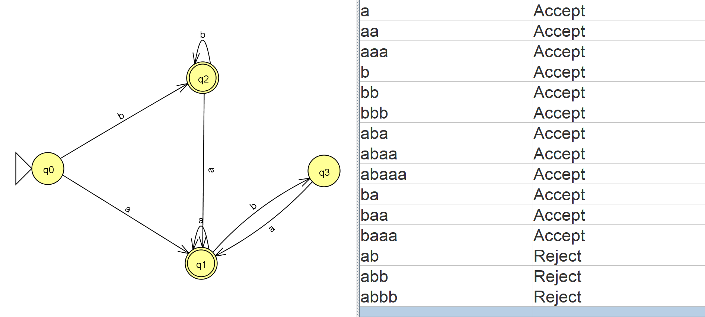

# UNISA

## COS2601 - Theoretical Computer Science II 	
- This was a module I completed while studying at the University of South Africa.

## Resources
- [NESO Academy's](https://www.youtube.com/watch?v=58N2N7zJGrQ&list=PLBlnK6fEyqRgp46KUv4ZY69yXmpwKOIev) playlist on youtube was a great source for a crash course on this topic
- [JFLAP](http://www.jflap.org/jflaptmp/) provides a way to quickly design, convert, minimise and test the output of FA. It is probably the most useful software in this course:

  

- [Ravindrababu Ravula](https://www.youtube.com/watch?v=dBwx2PVicTY)  also gives a great lecture on Kleene's theorem (how to convert RE to TG and vice versa)

### Assignment 1
* [Languages, Recursive Definitions, Regular Expressions](https://github.com/luyandamncube/UNISA/tree/master/year2/COS2601/ASS1)

### Assignment 2
* [Finite Automata, Transition Graphs](https://github.com/luyandamncube/UNISA/tree/master/year2/COS2601/ASS2)

### Assignment 3
* [Kleene's Theorem, Finite Automata with Output, Regular Languages, Nonregular Languages, Decidability](https://github.com/luyandamncube/UNISA/tree/master/year2/COS2601/ASS3)

### Exam
- All the above concepts tested
