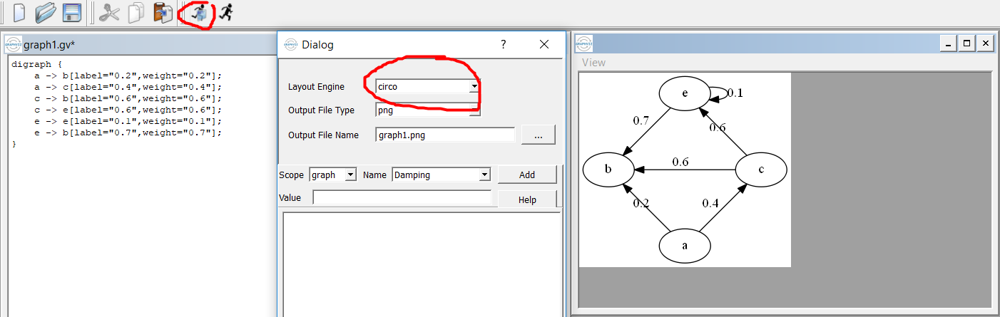

# UNISA

## COS2601 - Theoretical Computer Science II 	
- This was a module I completed while studying at the University of South Africa.
- [NESO Academy's](https://www.youtube.com/watch?v=58N2N7zJGrQ&list=PLBlnK6fEyqRgp46KUv4ZY69yXmpwKOIev) playlist on youtue was a great source for a crash course on this topic
- [GraphViz](https://graphviz.gitlab.io/_pages/Download/Download_windows.html) provides a good tool for drawing Finite Automata:

 

  

### Assignment 1
* [Languages, Recursive Definitions, Regular Expressions](https://github.com/luyandamncube/UNISA/tree/master/year2/COS2601/ASS1)

### Assignment 2
* [Finite Automata, Transition Graphs](https://github.com/luyandamncube/UNISA/tree/master/year2/COS2601/ASS2)

### Assignment 3
* [Kleene's Theorem, Finite Automata with Output, Regular Languages, Nonregular Languages, Decidability](https://github.com/luyandamncube/UNISA/tree/master/year2/COS2601/ASS3)

### Exam
- All the above concepts tested
