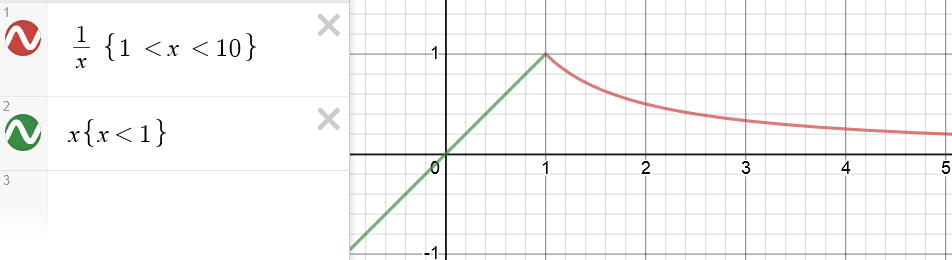

# UNISA

## MAT1613 - Calculus II
- This was a module I completed while studying at the University of South Africa.
- [Trefor Bazett](https://www.youtube.com/playlist?list=PLHXZ9OQGMqxfT9RMcReZ4WcoVILP4k6-m) has a great Calculus I playlist to revise concepts from this subjects pre-requisite, MAT1512
- [Trefor Bazett](https://www.youtube.com/playlist?list=PLHXZ9OQGMqxc4ySKTIW19TLrT91Ik9M4n) also has a great Calculus II playlist for this topic
- [WolframAlpha](https://www.wolframalpha.com/) is great calculator for integrals, limits, derivatives
- [Desmos](https://www.desmos.com/calculator) provides a great graphing tool. For example, graphing for a piecewise function:

  

- This [derivative calculator](https://www.derivative-calculator.net/) can be used for quickly calculating derivatives
- This [integral calculator](https://www.integral-calculator.com/) can be used for quickly calculating derivatives

### Assignment 1
* Graphs of functions, rates of change, optimization, L’Hopital’s rule.

### Assignment 2
* Substitution and integration by parts

### Assignment 3
* Integration, Taylor series

### Exam
- All the above concepts tested
