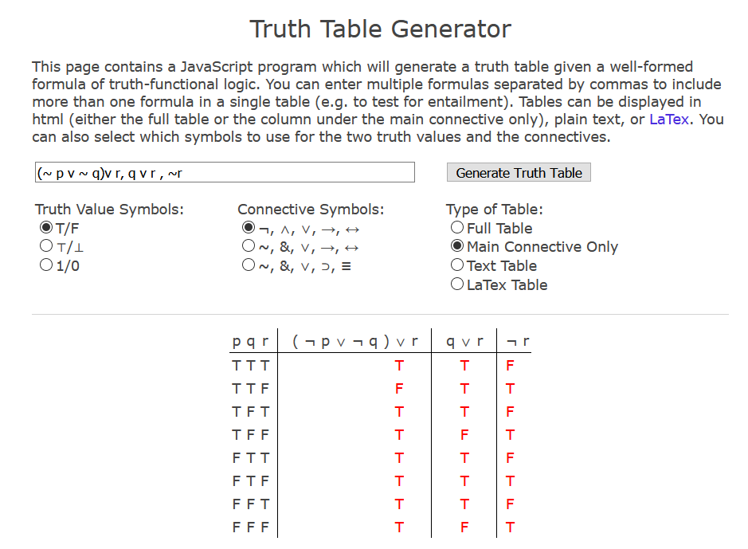

# UNISA

## COS3761 - Formal Logic III
- This was a module I completed while studying at the University of South Africa.
- [COS2661 Formal Logic II](https://github.com/luyandamncube/UNISA/tree/master/year2/COS2661) is the predecessor for this subject
- [Natural Deduction](http://teachinglogic.liglab.fr/DN/index.php) is a great tool for doing Natural Deduction quickly
- [Cheat Sheet](https://www.cosc.brocku.ca/~mwinter/Courses/4P42/CheatSheet.pdf) is a great summmary for Natural deduction rules
- [Truth table generator](https://mrieppel.net/prog/truthtable.html) is a great tool for doing truth tables online. With this truth table generator you can enter multiple formulas:
- example: show that the following sequent is valid by giving and appropriate valuation

  

- [Kane B](https://www.youtube.com/watch?v=EaCLZ9OZzAg&list=PLXKKIUdnOESGk43pUg3NTkRWjglvKXKi7) playlist on Modal Logic

### Assignment 1
* [Propositional Logic, Natural Deduction, Parse Trees](https://github.com/luyandamncube/UNISA/tree/master/year3/COS3761/ASS1/ASS1.txt)

### Assignment 2
* [Predicate Logic, Natural Deduction, Parse Trees, Formulas ](https://github.com/luyandamncube/UNISA/tree/master/year3/COS3761/ASS2/ASS2.pdf)

### Assignment 3
* [Kripke models, Modal Logic, Formula Schemes, Proof Strategies](https://github.com/luyandamncube/UNISA/tree/master/year3/COS3761/ASS2/ASS3.txt)

### Exam
- All the above concepts tested
